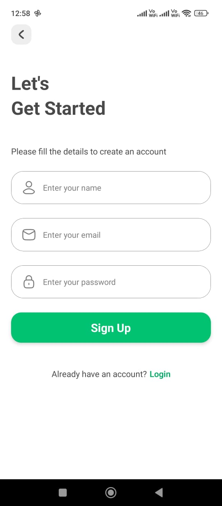

# Super Social App

This is a feature-rich social media application built with Expo and React Native. The app offers a seamless platform for users to connect, share, and interact through various engaging features.

## Key Features
- **User Authentication:** Secure Sign-Up and Sign-In functionality.
- **Post Management:** Create, edit, and delete posts with support for media uploads.
- **Profile Customization:** Edit and update user profile information.
- **Engagement Tools:** Like and comment on posts, including your own. View all comments and interactions on posts.

### Screenshots

## Technologies Used
- **Frontend:** React Native (Expo)
- **Backend:** Supabase for authentication and real-time database management
- **Storage:** Supabase Storage for media files

## Objectives
- Deliver a seamless and intuitive user experience.
- Provide real-time interaction and feedback through efficient backend integration.
- Implement secure and robust features for managing user data.

## How to Run
1. Clone the repository.
2. Install dependencies with `npm install` or `yarn install`.
3. Run the app with `expo start`.

This app demonstrates a clean and scalable approach to building social media platforms with a focus on functionality, design, and performance.
